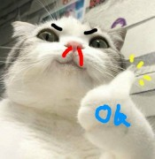

Don't even know how to code a game in Python, but hey! Atleast I know how to use AI (lol)

<!---
hypersplash/HyperSplash is a ✨ special ✨ repository because its `README.md` (this file) appears on HyperSplash's GitHub profile.
He or you can click the Preview link to take a look at your changes.
--->
